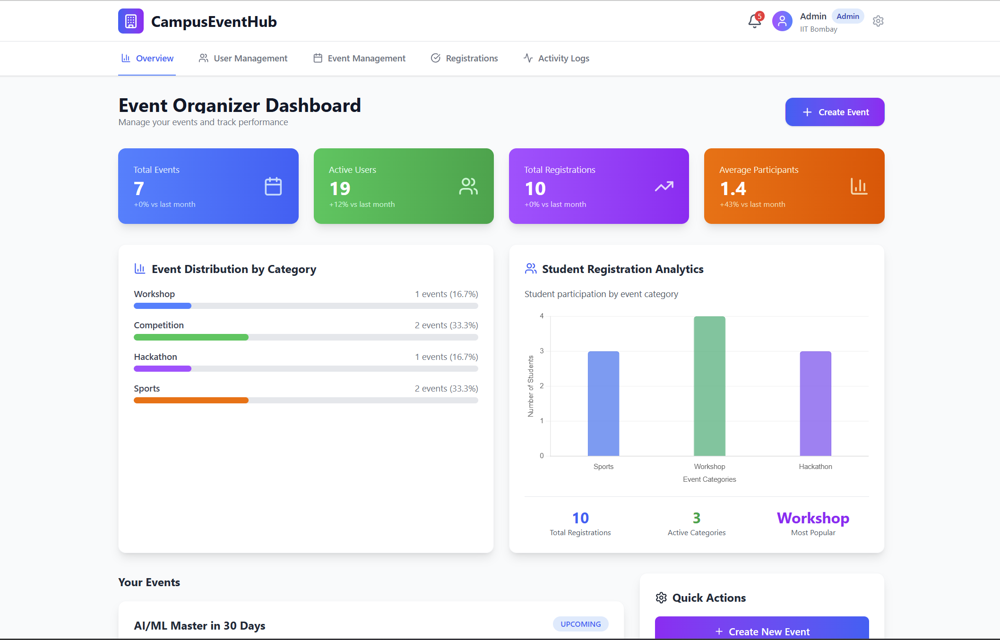

# 🎓 CampusEventHub
### Inter-College Event Management Platform

[](LICENSE)
[](https://nodejs.org/)
[](https://reactjs.org/)
[](https://www.mongodb.com/)

---

## 📖 Abstract

CampusEventHub is a **full-stack web application** that digitalizes and streamlines inter-college event management. It serves as a centralized hub where colleges can host cultural fests, hackathons, workshops, and sports competitions, while students can explore, register, and participate seamlessly.

The platform ensures **secure authentication**, **role-based access control**, and intuitive interfaces for both event creation and browsing, fostering transparency and enhanced student engagement across institutions.

---

## 🎯 Key Features

- 🔐 **Secure Authentication** with JWT and role-based access control
- 👨‍🎓 **Student Dashboard** for event browsing and registration
- 👩‍💼 **Admin Panel** for event creation and management
- 🔍 **Advanced Filtering** and search capabilities
- 📱 **Responsive Design** across all devices
- ⚡ **Real-time Updates** for event information

---

## 🛠️ Tech Stack

### Frontend


### Backend


### Development Tools


---

## 🏗️ Architecture & Design

### System Architecture


*Overall system architecture showing the interaction between frontend, backend, and database components*

### Architecture Overview
- **Frontend**: React.js with responsive design and real-time event listing
- **Backend**: Node.js + Express.js with RESTful APIs
- **Database**: MongoDB for scalable data storage
- **Authentication**: JWT-based secure authentication with role-based access
- **Deployment**: Cloud-ready with environment-based configuration

### Use Case Diagram


*Use case diagram illustrating the interactions between different user roles and system functionalities*

### Sequence Diagram


*Sequence diagram showing the flow of operations for key user interactions and system processes*

---

## 📊 Database Schema

### Core Models

#### 👤 Users
```javascript
{
  name: String,
  email: String (validated),
  password: String (hashed with bcrypt),
  college: String,
  role: ['student', 'college_admin', 'super_admin'],
  approval_status: ['pending', 'approved', 'rejected'],
  isActive: Boolean,
  createdAt: Date
}
```

#### 🎪 Events
```javascript
{
  title: String,
  description: String,
  category: ['Technical', 'Cultural', 'Sports', 'Workshop', 'Hackathon'],
  location: String,
  college_name: String,
  start_date: Date,
  end_date: Date,
  registration_limit: Number,
  current_registrations: Number,
  created_by: ObjectId,
  image: String,
  status: ['upcoming', 'active', 'completed']
}
```

#### 📝 Registrations
```javascript
{
  event_id: ObjectId,
  user_id: ObjectId,
  status: ['pending', 'approved', 'rejected'],
  timestamp: Date
}
```

#### 📋 Activity Logs
```javascript
{
  user_id: ObjectId,
  action: String,
  description: String,
  details: Object,
  timestamp: Date
}
```

---

## 🎨 UI Screenshots

### 🔐 Authentication
| Login Page | Registration Page |
|------------|-------------------|
|  |  |

### 📊 Dashboards
| Student Dashboard | Admin Dashboard |
|-------------------|-----------------|
|  |  |

### 📝 Event Management
| Event Creation Form |
|---------------------|
|  |

---

## 🚀 Getting Started

### Prerequisites
- Node.js (v16 or higher)
- MongoDB (v4.4 or higher)
- npm or yarn package manager

### Installation

1. **Clone the repository**
   ```bash
   git clone https://github.com/your-username/campus-eventhub-team1.git
   cd campus-eventhub-team1
   ```

2. **Backend Setup**
   ```bash
   cd Backend
   npm install
   cp .env.example .env  # Configure your environment variables
   npm start
   ```

3. **Frontend Setup**
   ```bash
   cd ../frontend
   npm install
   npm run dev
   ```

4. **Access the Application**
   - Frontend: `http://localhost:5173`
   - Backend API: `http://localhost:4000`

---

## 🧪 Testing

### API Testing
- **Tool**: Postman for comprehensive API endpoint testing
- **Coverage**: Authentication flows, event CRUD operations, user management
- **Test Cases**: Registration/login validation, role-based access, event filtering

### System Testing
- ✅ User registration and authentication
- ✅ Role-based dashboard access
- ✅ Event creation and management
- ✅ Event browsing and filtering
- ✅ Responsive design validation

---

## 📦 Deployment

### Backend Deployment
```bash
# Build and deploy backend
cd Backend
npm run build
# Deploy to cloud platform (Render/Heroku)
```

### Frontend Deployment
```bash
# Build React application
cd frontend
npm run build
# Deploy to Netlify/Vercel
```

---

## 👥 User Guide

### For Students 🎓
1. **Register/Login** → Access your student dashboard
2. **Browse Events** → View events from all colleges with filters
3. **View Details** → Get comprehensive event information
4. **Register** → Sign up for events of interest

### For Admins 👩‍💼
1. **Admin Login** → Access administrative dashboard
2. **Create Events** → Add new events with detailed information
3. **Manage Events** → Edit, update, or delete existing events
4. **Monitor** → Track event registrations and engagement

---

## 🎯 Project Milestones

### ✅ Milestone 1: Authentication & Authorization
- Secure user registration with email validation
- JWT token-based authentication
- Role-based access control (Student, College Admin, Super Admin)
- Password encryption with bcrypt

### ✅ Milestone 2: Event Management System
- Admin event creation functionality
- Student event browsing with advanced filtering
- Responsive UI components

### 🔄 Future Enhancements
- Real-time notifications system
- Event feedback and rating system
- Participant slot management
- Payment integration
- Advanced analytics dashboard

---

## 📈 Results & Impact

CampusEventHub successfully demonstrates a **functional, secure, and scalable** event management ecosystem. The platform provides:

- **Enhanced Accessibility**: Centralized event discovery for students
- **Streamlined Management**: Simplified event creation and administration
- **Improved Engagement**: Better participation tracking and communication
- **Scalable Foundation**: Ready for future feature expansions

---

## 🤝 Contributing

1. Fork the repository
2. Create a feature branch (`git checkout -b feature/AmazingFeature`)
3. Commit your changes (`git commit -m 'Add some AmazingFeature'`)
4. Push to the branch (`git push origin feature/AmazingFeature`)
5. Open a Pull Request

---

## 📄 License

This project is licensed under the MIT License - see the [LICENSE](LICENSE) file for details.

---

## 👨‍💻 Team

**CampusEventHub - Team 1**

- **GitHub Repository**: [CampusEventHub Project](https://github.com/your-username/campus-eventhub-team1)
- **Documentation**: Complete project documentation available in `/docs`

---

<div align="center">

### 🌟 Star this repository if you found it helpful!

**Built with ❤️ for better campus event management**

</div>