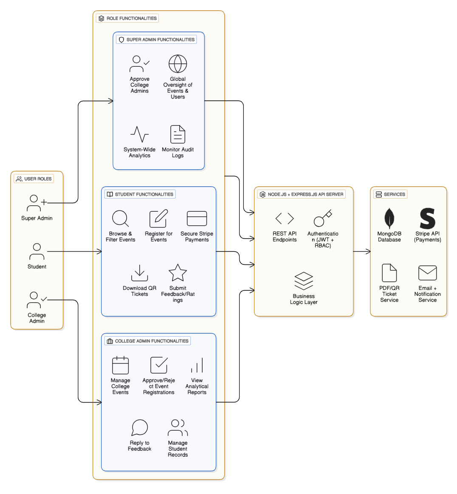
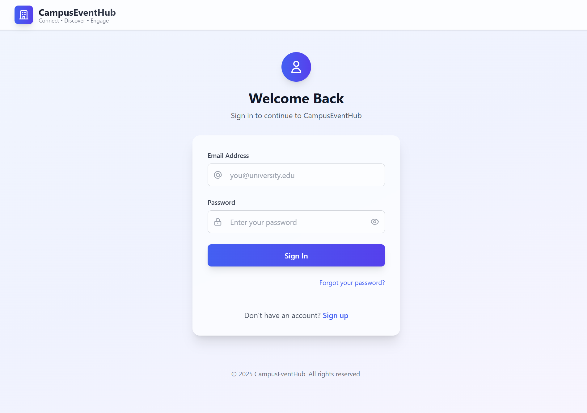
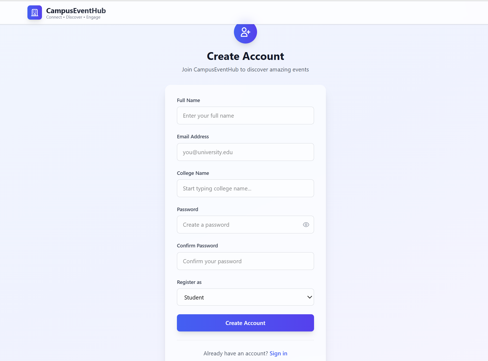
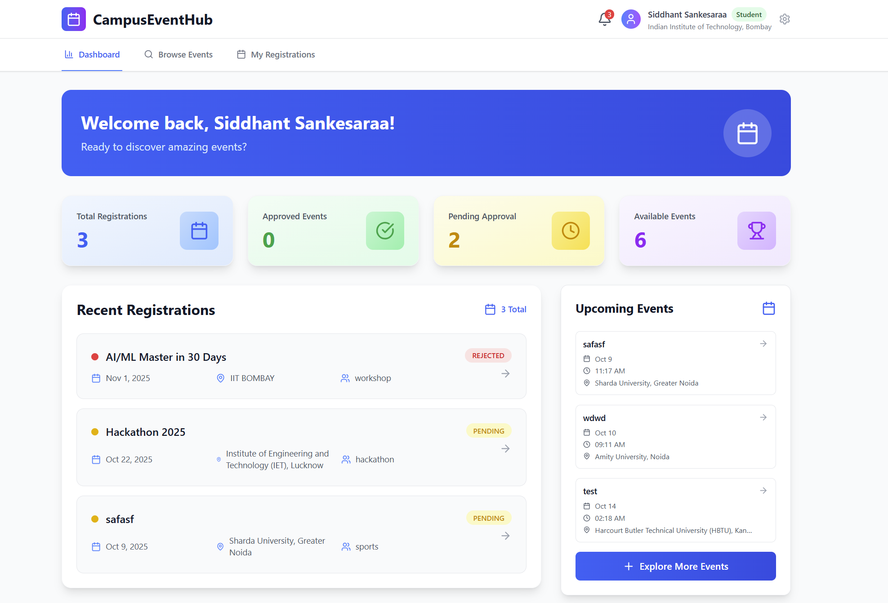
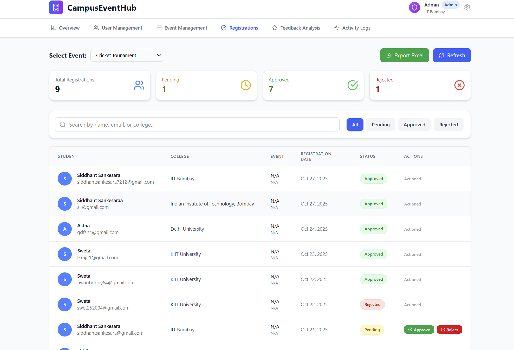
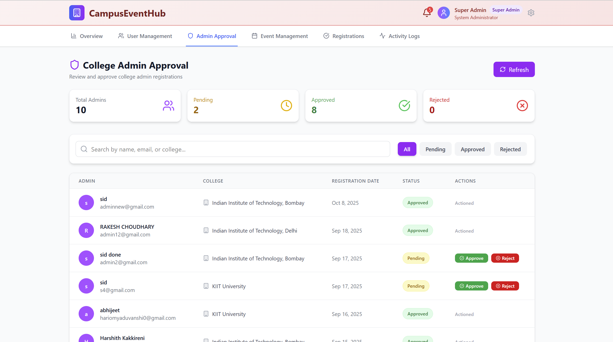

# 🎓 CampusEventHub
### Inter-College Event Management Platform

[](LICENSE)
[](https://nodejs.org/)
[](https://reactjs.org/)
[](https://www.mongodb.com/)

---

## 📖 Abstract

CampusEventHub is a **full-stack web application** that digitalizes and streamlines inter-college event management. It serves as a centralized hub where colleges can host cultural fests, hackathons, workshops, and sports competitions, while students can explore, register, and participate seamlessly.

The platform ensures **secure authentication**, **role-based access control**, and intuitive interfaces for both event creation and browsing, fostering transparency and enhanced student engagement across institutions.

---

## 🎯 Key Features

- 🔐 **Secure Authentication** with JWT and role-based access control
- 👨‍🎓 **Student Dashboard** for event browsing and registration
- 👩‍💼 **College Admin Panel** for event and user management
- 👑 **Super Admin Dashboard** with system-wide control
- 📊 **Registration Management** with approval workflow
- 📈 **Real-time Analytics** with interactive charts
- 🔍 **Advanced Filtering** and search capabilities
- 📱 **Responsive Design** across all devices
- 📋 **Activity Logging** for audit trails

---

## 🛠️ Tech Stack

### Frontend


### Backend


### Development Tools


---

## 🏗️ Architecture & Design

### System Architecture



*Overall system architecture showing the interaction between frontend, backend, and database components*

### Architecture Overview
- **Frontend**: React.js with responsive design and real-time event listing
- **Backend**: Node.js + Express.js with RESTful APIs
- **Database**: MongoDB for scalable data storage
- **Authentication**: JWT-based secure authentication with role-based access
- **Deployment**: Cloud-ready with environment-based configuration

### Use Case Diagram


*Use case diagram illustrating the interactions between different user roles and system functionalities*

### Sequence Diagram


*Sequence diagram showing the flow of operations for key user interactions and system processes*

---

## 📊 Database Schema

### Core Models

#### 👤 Users
```javascript
{
  name: String,
  email: String (validated),
  password: String (hashed with bcrypt),
  college: String,
  role: ['student', 'college_admin', 'super_admin'],
  approval_status: ['pending', 'approved', 'rejected'],
  isActive: Boolean,
  createdAt: Date
}
```

#### 🎪 Events
```javascript
{
  title: String,
  description: String,
  category: ['Technical', 'Cultural', 'Sports', 'Workshop', 'Hackathon'],
  location: String,
  college_name: String,
  start_date: Date,
  end_date: Date,
  registration_limit: Number,
  current_registrations: Number,
  created_by: ObjectId,
  image: String,
  status: ['upcoming', 'active', 'completed']
}
```

#### 📝 Registrations
```javascript
{
  event_id: ObjectId,
  user_id: ObjectId,
  status: ['pending', 'approved', 'rejected'],
  timestamp: Date
}
```

#### 📋 Activity Logs
```javascript
{
  user_id: ObjectId,
  action: String,
  description: String,
  details: Object,
  timestamp: Date
}
```

---

## 🎨 UI Screenshots

### 🔐 Authentication

#### Login Page


*Secure login interface with email validation, password requirements, and forgot password functionality*

#### Registration Page


*User registration with college selection, role assignment, and real-time form validation*

---

### 👨‍🎓 Student Interface

#### Student Dashboard


*Personalized dashboard showing registered events, quick stats, and recent registrations with status tracking*

#### Browse Events Page


*Comprehensive event listing with advanced filters by category, date, and search functionality across all colleges*

#### Event Registration Form


*Detailed event registration interface with event information, capacity tracking, and confirmation dialog*

---

### 👩‍💼 College Admin Interface

#### Admin Dashboard


*College admin dashboard with event management, analytics charts, and quick actions panel featuring blue theme*

#### Event Creation Form


*Multi-step event creation form with college selection, event details, schedule configuration, and registration settings for seamless event setup*

#### Registration Management


*Registration approval interface for managing student applications with pending, approved, and rejected status workflow*

---

### 👑 Super Admin Interface

#### User Management


*Comprehensive user management page where super admin can view, manage, and filter both college admins and students across all institutions*

#### Admin Approval


*College admin approval interface for super admin to review and approve/reject college admin registration requests*

#### Activity Logs


*Complete audit trail showing all administrative actions with timestamps, user details, and action descriptions for accountability and monitoring*

---

## 🚀 Getting Started

### Prerequisites
- Node.js (v16 or higher)
- MongoDB (v4.4 or higher)
- npm or yarn package manager

### Installation

1. **Clone the repository**
   ```bash
   git clone https://github.com/your-username/campus-eventhub-team1.git
   cd campus-eventhub-team1
   ```

2. **Backend Setup**
   ```bash
   cd Backend
   npm install
   cp .env.example .env  # Configure your environment variables
   npm start
   ```

3. **Frontend Setup**
   ```bash
   cd ../frontend
   npm install
   npm run dev
   ```

4. **Create Super Admin (Optional)**
   ```bash
   cd Backend
   node scripts/createSuperAdmin.js
   ```
   Default credentials:
   - Email: `superadmin@campuseventhub.com`
   - Password: `SuperAdmin@2025`

5. **Access the Application**
   - Frontend: `http://localhost:5173`
   - Backend API: `http://localhost:4000`

---

## 🧪 Testing

### API Testing
- **Tool**: Postman for comprehensive API endpoint testing
- **Coverage**: Authentication flows, event CRUD operations, user management
- **Test Cases**: Registration/login validation, role-based access, event filtering

### System Testing
- ✅ User registration with email validation
- ✅ Three-tier role-based access control
- ✅ Event CRUD operations with image upload
- ✅ Registration approval workflow
- ✅ Real-time analytics and charts
- ✅ Activity logging system
- ✅ Super admin approval management
- ✅ Responsive design across devices

---

## 📦 Deployment

### Backend Deployment
```bash
# Build and deploy backend
cd Backend
npm run build
# Deploy to cloud platform (Render/Heroku)
```

### Frontend Deployment
```bash
# Build React application
cd frontend
npm run build
# Deploy to Netlify/Vercel
```

---

## 👥 User Guide

### For Students 🎓
1. **Register/Login** → Access your student dashboard
2. **Browse Events** → View events from all colleges with filters
3. **View Details** → Get comprehensive event information
4. **Register** → Submit registration (awaits admin approval)
5. **Track Status** → Monitor your registration status (Pending/Approved/Rejected)

### For College Admins 👩‍💼
1. **Admin Login** → Access college-specific admin dashboard
2. **View Analytics** → See registration statistics and charts
3. **Create Events** → Add new events for your college
4. **Manage Registrations** → Approve or reject student applications
5. **Monitor Students** → View and manage students from your college
6. **Activity Logs** → Track all administrative actions

### For Super Admin 👑
1. **Super Admin Login** → Access system-wide dashboard with red theme
2. **Global Access** → View all events and users across all colleges
3. **Approve Admins** → Manage college admin approval requests
4. **System Analytics** → View comprehensive registration analytics
5. **Full Control** → Complete access to all system features

---

## 🎯 Project Milestones

### ✅ Milestone 1: Authentication & Authorization
- Secure user registration with email validation
- JWT token-based authentication
- Role-based access control (Student, College Admin, Super Admin)
- Password encryption with bcrypt

### ✅ Milestone 2: Event Management System
- College admin event creation with image upload
- Student event browsing with category filters
- Event capacity management
- Responsive UI with Tailwind CSS
- Real-time event status updates

### ✅ Milestone 3: Advanced Admin Features & Analytics
- **Three-tier role system**: Student, College Admin, Super Admin
- **Registration workflow**: Pending → Approved/Rejected status
- **Super Admin dashboard**: System-wide control with unique red theme
- **College Admin approval**: Super admin manages college admin accounts
- **Real-time analytics**: Chart.js bar graphs showing student participation
- **Activity logging**: Complete audit trail of admin actions
- **Data isolation**: College admins see only their college data
- **Registration management**: Dedicated tab for approval workflow
- **User management**: Role-based user viewing and filtering

### 🔄 Future Enhancements
- Real-time push notifications
- Event feedback and rating system
- Payment gateway integration
- Email notifications for registration status
- Advanced reporting and exports

---

## 📈 Results & Impact

CampusEventHub successfully demonstrates a **functional, secure, and scalable** event management ecosystem. The platform provides:

- **Enhanced Accessibility**: Students discover events across all colleges
- **Streamlined Administration**: Intuitive dashboards for event and user management
- **Data-Driven Insights**: Real-time analytics for better decision making
- **Secure Workflows**: Approval-based registration system
- **Role-Based Control**: Three-tier access system with proper isolation
- **Audit Trail**: Complete activity logging for accountability
- **Scalable Architecture**: Ready for enterprise deployment

### Key Achievements
- ✅ **100% Role-Based Access** control implementation
- ✅ **Real-time Analytics** with Chart.js integration
- ✅ **Complete CRUD** operations for all entities
- ✅ **Responsive Design** for mobile and desktop
- ✅ **Secure Authentication** with JWT and bcrypt

---

## 🤝 Contributing

1. Fork the repository
2. Create a feature branch (`git checkout -b feature/AmazingFeature`)
3. Commit your changes (`git commit -m 'Add some AmazingFeature'`)
4. Push to the branch (`git push origin feature/AmazingFeature`)
5. Open a Pull Request

---

## 📄 License

This project is licensed under the MIT License - see the [LICENSE](LICENSE) file for details.

---

## 👨‍💻 Team

**CampusEventHub - Team 1**

- **GitHub Repository**: [CampusEventHub Project](https://github.com/your-username/campus-eventhub-team1)
- **Documentation**: Complete project documentation available in `/docs`

---

<div align="center">

### 🌟 Star this repository if you found it helpful!

**Built with ❤️ for better campus event management**

</div>